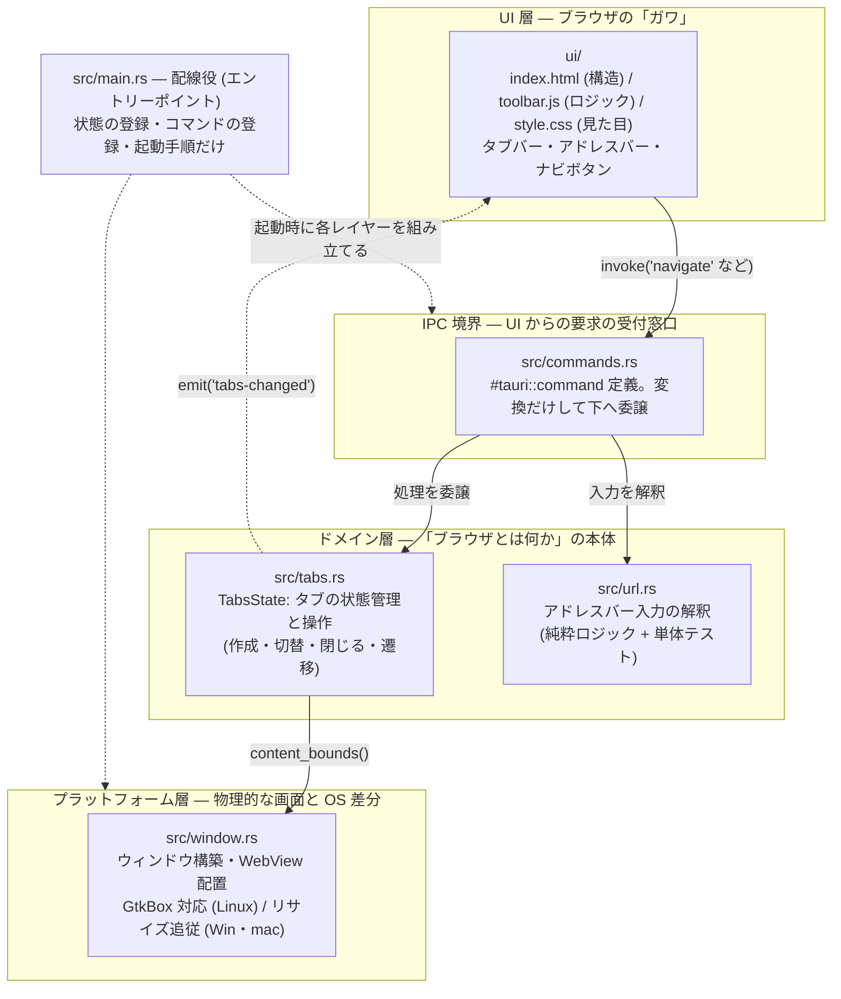

# アーキテクチャ: レイヤー構成とブラウザ理解の対応

kjr-browser は「名前を見れば役割がわかる」ことと「実際のブラウザの構造理解につながる」ことを
狙ってレイヤー分けしている。

## レイヤー図

依存 (実線) は必ず上から下への一方向。下のレイヤーは上のレイヤーを知らない。
下から上への通知は Tauri のイベント (点線) だけで行い、名前しか知らない疎結合に保つ。

## 本物のブラウザとの対応

この構成は Chrome / Firefox のマルチプロセスアーキテクチャの縮図になっている:

| kjr-browser | 本物のブラウザ (Chrome) | 役割 |
|---|---|---|
| Rust 側全体 (src-tauri) | **ブラウザプロセス** | タブ管理、ウィンドウ、ナビゲーション制御。全体の司令塔 |
| toolbar WebView (ui/) | **ブラウザ UI (chrome)** | タブバー・アドレスバー。Chrome 自身も UI の多くを Web 技術で描いている |
| tab-N WebView | **レンダラプロセス** | Web ページの解析と描画。タブごとに分離される |
| invoke / emit (IPC) | **Mojo IPC** | UI ↔ 司令塔間のメッセージング |
| WebKitGTK / WKWebView / WebView2 | **Blink / Gecko** | レンダリングエンジン本体 (本プロジェクトでは OS のものを借りる) |

セキュリティ境界も同じ発想で引いている: Web ページを表示する tab-N WebView には
IPC 権限を与えない (`capabilities/default.json` は toolbar のみ許可)。
本物のブラウザで「レンダラプロセスはサンドボックス内で動き、特権操作は
ブラウザプロセスに依頼する」のと同じ構造である。

## 各モジュールの責務と「増やすときどこに書くか」

| ファイル | 責務 | 例: 今後の機能はどこへ? |
|---|---|---|
| `main.rs` | 配線のみ (状態登録・コマンド登録・起動手順) | 新モジュールの `mod` 宣言、コマンド登録 |
| `commands.rs` | IPC の受付。薄いラッパーに保つ | ブックマーク追加コマンドの「窓口」 |
| `tabs.rs` | タブのドメインロジックと状態 | タブ複製、ピン留め |
| `url.rs` | 入力解釈の純粋ロジック (テストもここ) | 検索エンジン切替、`localhost` 特別扱い |
| `window.rs` | ウィンドウ構築・OS 差分 | ダークモード対応、全画面化 |
| (将来) `history.rs` | 履歴の永続化 (Phase 3) | 履歴・ブックマーク |

新しい機能を足すときの流れは常に同じ:
1. ドメインロジックを `tabs.rs` など該当レイヤーに書く
2. `commands.rs` に薄い窓口を足す
3. `main.rs` の `generate_handler!` に登録する
4. `ui/toolbar.js` から invoke する

## なぜ `main.rs` / `index.html` という名前なのか

- `src/main.rs` は **Cargo の規約**でバイナリのエントリーポイントに固定されている
  (中の `fn main()` が起動関数)。だからこそ中身は配線だけに保ち、実体は
  役割名のモジュールへ逃がす。
- `ui/index.html` は Rust 側の `WebviewUrl::App("index.html")` が参照する名前で、
  「ディレクトリ配信のデフォルトは index.html」という Web の慣習に合わせている。
  スクリプトの名前 (toolbar.js) には規約がないので役割で命名している。
